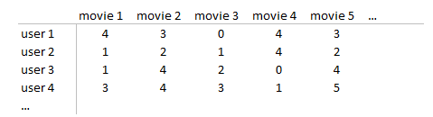
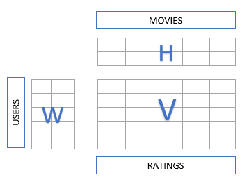
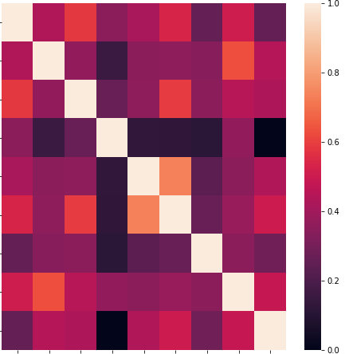
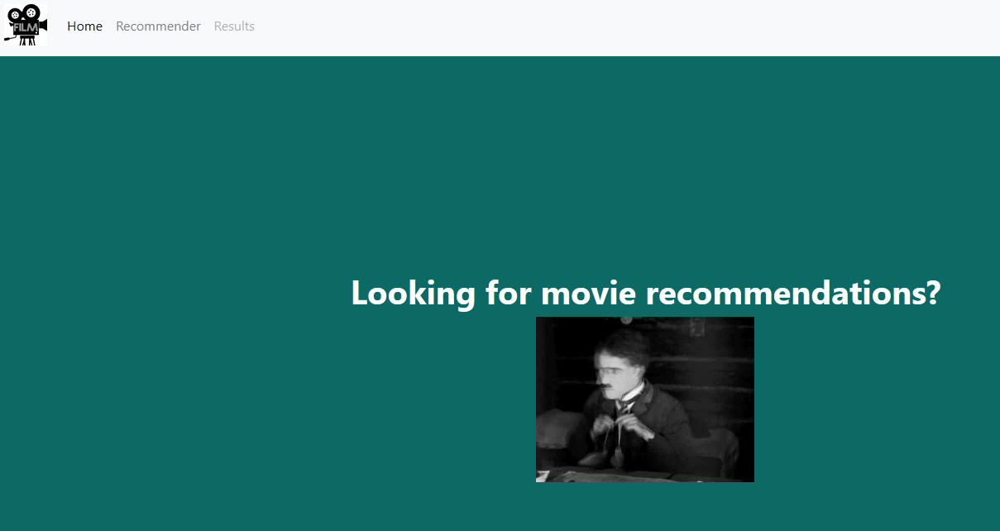
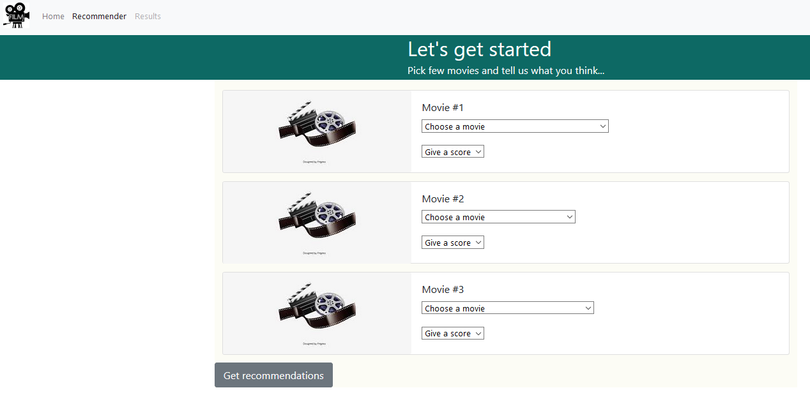
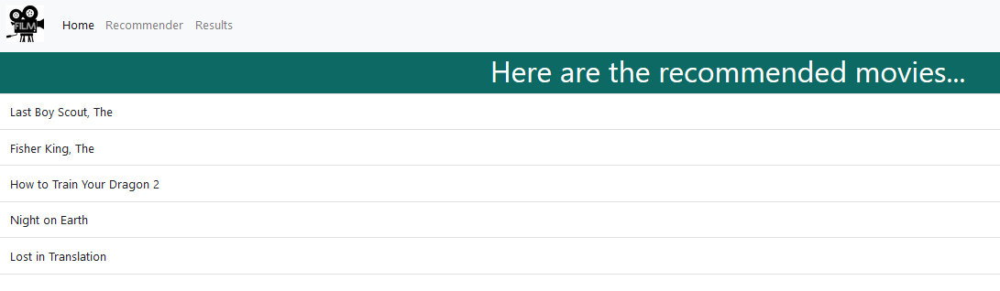

# Movie Recommender System

## Synopsis
The goal of this project is to create a movie recommender with a web interface. The recommendation model is based on the MovieLens dataset (https://grouplens.org/datasets/movielens/)

## Data
The recommender uses the small dataset (100,000 ratings and 3,600 tag applications applied to 9,000 movies by 600 users). 

The original data consists of several csv files: links, movies, ratings and tags. Using the library sqlalchemy, I store the data in a PostGreSQL database and query it when needed. 

Add the PostGreSQL credentials (username, password and database name) in the *postgres_data.py*.

## Algorithms
We could use the following unsupervised models in our recommender system.

### Non-negative Matrix Factorization (NMF) Model
The starting point is a rating matrix,

The goal is to describe this matrix by some hidden features (for example, a user gives higher ratings to a particular movie genre) such as the matrix (V) is factorized into two matrices (W- user features and H-movie features) that contain the inherent aspects/features.

- All three matrices have no negative elements.
- The product of W and H approximates V

It might be that there are empty elements (NaNs) in the matrix V with the ratings; we could replace the NaNs with: Zeros, the median of the whole matrix or the median of each movie.

The NMF model is implemented in sklearn: given a new user and few ratings of movies in the dataset, calculate the hidden profile of the user (use the nmf trained model) and multiply it with the model components. If we sort the result (max to min while keeping track of the order of the movies) we'll get the movies to recommend the new user.

### Cosine Similarities
The idea behind this algorithm is to find the most similar users and get recommendations based on this similarity: if user1 and user2 rated movie1, movie2 and movie3 similarly but user2 has not seen movie4, this movie might be a good recommendation for user2.

When applying this algorithm, one could visualize (with a heat map) the similarity of various users,

To get recommendations for a new user: add the new user and some ratings of already existing movies in the dataset. Calculate the cosine similarity of all users (including the new one) and find those users with the most similarity to the new user. Among the movies rated by the similar users, check which movies got high ratings (and the new user hasn't seen yet) and recommend them to the new user.  

## Web Interface
The web interface was created with Flask and also used few elemnts from the Bootstrap library.

To run the web, run the file *application.py*. The *templates* folder contains the html files and *static* the css file and images. 
  

